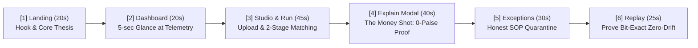

# Realm Verify — Hackathon Demo & Pitch Playbook
**Razorpay AI Buildathon 2026 · AI Finance Controller Track**

---

## ⚡ 1. The 5-Screen Golden Demo Path (3-Minute Script)

> **Golden Rule for Demo Day:** Do not click through all 8 screens live. Follow this strict 5-screen golden path (~3 minutes total). Treat the **Evidence Ledger** and **Architecture** pages as "if they ask" deep-dive backup screens or slides.



---

### Step 1: Landing Hero (`/` — 20 seconds)
- **Action:** Open root URL `http://localhost:3000/`. Keep cursor over the hero badge.
- **Speaker Line:**
  > *"Judges, in finance operations, generation speed is cheap—verification capacity is the real bottleneck. Every day, finance teams lose thousands of hours manually ticking off bank statements against gateway settlement batches. We built **Realm Verify**: where AI discovers candidate links, deterministic integer mathematics decides, and a tamper-evident hash chain proves every single rupee down to 0 paise."*
- **Click:** Click **"RUN RECONCILIATION"** or **"VIEW DASHBOARD"**.

---

### Step 2: Finance Control Room Dashboard (`/dashboard` — 20 seconds)
- **Action:** Point at the Reconciled Balance card and the Concentric Anomaly Arcs.
- **Speaker Line:**
  > *"Here is the live Finance Operations Control Room. Across 1,266 synthetic and enterprise multi-ledger records, Realm Verify achieves a **73.6% auto-approval rate** with **zero committed false matches**. Notice every widget here serves a decisive FinOps purpose: tracking net clearing velocity, detecting gateway fee leakage, and monitoring timing skews across bank feeds."*
- **Click:** Click **"Ingest & Reconcile"** button in top right to go to `/reconciliation`.

---

### Step 3: Reconciliation Studio & Custom Upload (`/reconciliation` — 45 seconds)
- **Action:** Click **"Ingest Files / Open Studio"**. Show the upload drawer or sample loader. Click **"Load Enterprise Sample Files"** and **"Execute Ingestion & Reconcile"**.
- **Speaker Line:**
  > *"This is the Reconciliation Studio running our real two-stage combinatorial matcher. It takes three real messy sources: Core Billing Transactions, Gateway Settlement Batches (like Razorpay), and Bank Statements. It solves 1:1, Many:1 batch settlements via bounded subset-sum search, and 1:Many split payouts—all computed in integer paise minor units so rounding errors are mathematically impossible."*
- **Visual Cue:** Show the live results table filter into `AUTO_APPROVED`, `NEEDS_REVIEW`, and `UNRESOLVED`.

---

### Step 4: The Money Shot — Decision Explainability Modal (40 seconds)
- **Action:** In the reconciliation table, click the **"Explain"** button next to settlement `PO_2001` or `PO_2026_001`.
- **Speaker Line:**
  > *"This is the money shot: explainable AI for financial auditability. When a CFO asks 'Why was this batch approved?', Realm Verify doesn't give a black-box probability. It presents a **0-paise arithmetic proof**: Gross (₹1,250) minus Fees (₹25) exactly equals Net (₹1,225) with zero residual. Furthermore, all 5 pipeline agents signed off on date window tolerances, token references, and single-allocation invariants."*
- **Action:** Close the modal.

---

### Step 5: Exception Queue & Honest Quarantine (`/exceptions` — 30 seconds)
- **Action:** Click **"Exceptions"** in the Golden Path bar or navbar.
- **Speaker Line:**
  > *"Most AI reconciliation tools fail when they hallucinate matches on ambiguous records. Realm Verify has a **Zero-Guess Policy**. When a payout balance equation fails or a cross-currency USD transaction appears without an FX rate, it is quarantined into the Exception Queue with a deterministic SOP action plan ready for human-in-the-loop review."*

---

### Step 6: Deterministic Replay Engine (`/replay` — 25 seconds)
- **Action:** Click **"Replay"** in the Golden Path bar. Click **"Execute Deterministic Replay"**.
- **Speaker Line:**
  > *"Finally, we prove provable trust. We take an existing historical audit run ID and re-execute the entire pipeline from scratch. Result: **0 decision flips, 0 paise balance deviation, and bit-exact identical hash chains**. That is a falsifiable claim that black-box LLM systems simply cannot make."*

---

## 🎯 2. What to Lean Into for Your Pitch & Slide Deck

### 1. The Core Thesis (Slide 1 or Intro)
> *"Verification capacity—not generation speed—is the bottleneck in finance operations. AI may interpret messy operational evidence, but it must never commit a financial decision unless deterministic accounting constraints validate it."*

### 2. The 5-Agent Consensus Gatekeeper (Slide 2)
```text
Agent 1: Schema Normalizer      → Extracts tokens & converts all money to integer paise
Agent 2: Combinatorial Matcher  → Bounded subset-sum & bipartite candidate search
Agent 3: Bank Linkage Agent     → Split-settlement & multi-tier narration parsing
Agent 4: Advisory LLM Re-Ranker → Re-ranks residual ambiguous clusters (Strict Pydantic JSON)
Agent 5: Accounting Validator   → Zero-Tolerance Gatekeeper (0 Paise Residual Invariant)
```

**Verbatim Line to Answer "Why not let LLM decide?":**
> *"The LLM acts strictly as an advisory candidate re-ranker. It is mathematically barred from committing financial decisions, mutating ledger balances, or calculating settlement amounts. Only deterministic integer arithmetic can commit a transaction."*

### 3. Formal Hard Accounting Constraints (Slide 3)
1. **Payout Internal Balance Invariant:** $\text{gross} - \text{fees} - \text{refunds} - \text{chargebacks} == \text{net}$ ($0\text{ paise}$ residual).
2. **Stage 1 Batch Gross Invariant:** $\sum \text{txn.gross\_minor} == \text{payout.gross\_minor}$ ($0\text{ paise}$ residual).
3. **Stage 2 Bank Net Invariant:** $\sum \text{bank.credit\_minor} == \text{payout.net\_minor}$ ($0\text{ paise}$ residual).
4. **Temporal Settlement Tolerance:** $\text{txn.created\_at} \le \text{payout.settled\_at} \le \text{bank.value\_date} + \text{tolerance}$.
5. **Uniqueness Constraint:** Zero double-allocation across any ledger entity.

### 4. Deterministic Replay Proof (Slide 4)
| Metric | Realm Verify Commitment | Measured Result |
| :--- | :--- | :--- |
| **False-Match Rate** | **0.00%** | 0 committed errors across all runs |
| **Balance Residual** | **0 paise** | Exact mathematical equality |
| **Replay Decision Flips** | **0 flips** | 100% bit-exact replay reproducibility |
| **Audit Log Integrity** | **SHA-256 Chained** | Unbroken block hash link |

---

## 🛡️ 3. Q&A Defense Matrix (Answering Tough Judge Questions)

### Q1: "Is this actually blockchain?"
> **Answer:** *"No, and we deliberately don't call it that. It is an **append-only, tamper-evident audit ledger using SHA-256 hash chaining**—the exact same cryptographic data structure used by Git and high-assurance banking audit logs. Every decision block hashes the previous block's digest, guaranteeing that once committed, historical reconciliation decisions cannot be retroactively altered."*

### Q2: "Why can't I just prompt GPT-4 to reconcile my CSVs?"
> **Answer:** *"LLMs suffer from three fatal flaws in finance: floating-point arithmetic errors, non-deterministic outputs on identical data, and hallucinated linkages when candidate references are noisy. Realm Verify uses AI purely where it excels—interpreting unstructured text narrations and token similarities—while enforcing hard deterministic Python integer constraints for the actual financial commitment."*

### Q3: "How does it handle Many-to-One batch settlements?"
> **Answer:** *"When Razorpay settles 50 customer payments in a single lump sum, simple exact-matching fails. Realm Verify runs a **bounded subset-sum solver** constrained by settlement time windows to discover the exact combination of internal transactions whose gross sum equals the payout gross down to the exact paisa."*

### Q4: "Is the custom data upload live or mocked?"
> **Answer:** *"It is 100% live Python execution end-to-end. When you upload CSV or JSON files in the Ingestion Studio, our FastAPI backend parses the data, runs the bipartite combinatorial matcher, validates all five 0-paise constraints, appends the SHA-256 event block to SQLite, and streams the exact audit results back to the UI in milliseconds."*

---

## 🏁 4. Quick Checklist Before You Step on Stage

- [x] Backend running on `http://127.0.0.1:8000` (`python -m uvicorn src.api:app --reload`).
- [x] Frontend running on `http://localhost:3000` (`npm run dev`).
- [x] Pytest suite passes 19/19 tests (`pytest`).
- [x] Test the Golden Path Bar in the browser (bottom floating pill).
- [x] Rehearse the 3-minute script twice.
