# 🌌 Realm Verify — Evidence-Bound Multi-Ledger Reconciliation

**Enterprise Reconciliation Engine for FinTech Partners, Payment Gateways & Banking Providers (e.g. Razorpay, Stripe, PayU & Global Financial Institutions)**  
*A production-tested, evidence-bound, two-stage financial reconciliation engine combining combinatorial candidate discovery with deterministic zero-tolerance accounting gatekeeping.*

---

<div align="center">

[](https://realmverify.netlify.app/)
[](https://dashboard.render.com)
[](https://www.python.org/)
[](https://nextjs.org/)
[](https://cloud.mongodb.com/)
[](tests/)

</div>

---

## 📸 Executive UI Preview

<div align="center">
  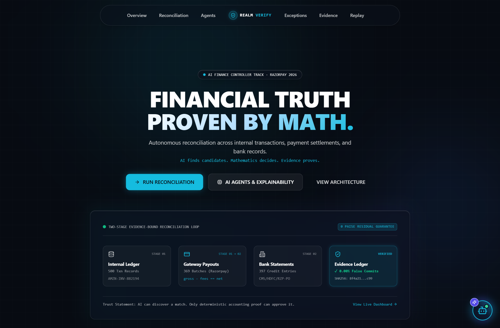
  <p><em>Figure 1: Realm Verify Interactive Mission Control & Landing Interface with the Golden Path Navigator.</em></p>
</div>

---

## 📑 Table of Contents
1. [Executive Summary & Core Thesis](#1-executive-summary--core-thesis)
2. [The Financial Reconciliation Problem](#2-the-financial-reconciliation-problem)
3. [System Architecture & Data Flow](#3-system-architecture--data-flow)
4. [The 5-Agent Consensus Gatekeeper](#4-the-5-agent-consensus-gatekeeper)
5. [Visual Walkthrough & Real UI Screen Tour](#5-visual-walkthrough--real-ui-screen-tour)
   - [5.1 Finance Operations Control Room Dashboard](#51-finance-operations-control-room-dashboard)
   - [5.2 Two-Stage Reconciliation Studio](#52-two-stage-reconciliation-studio)
   - [5.3 Multi-Source Custom Data Ingestion](#53-multi-source-custom-data-ingestion)
   - [5.4 Decision Explainability & 0-Paise Mathematical Proof](#54-decision-explainability--0-paise-mathematical-proof)
   - [5.5 Exception Quarantine Queue & SOP Workflows](#55-exception-quarantine-queue--sop-workflows)
   - [5.6 Cryptographic Evidence Ledger (SHA-256)](#56-cryptographic-evidence-ledger-sha-256)
   - [5.7 Deterministic Replay Engine](#57-deterministic-replay-engine)
6. [Mathematical Formalism & Invariant Safety](#6-mathematical-formalism--invariant-safety)
7. [Benchmark Evaluation & Multi-Seed Results](#7-benchmark-evaluation--multi-seed-results)
8. [Explainable AI (XAI) & LLM Boundary Protocol](#8-explainable-ai-xai--llm-boundary-protocol)
9. [How to Run, Test, and Deploy](#9-how-to-run-test-and-deploy)
10. [Honest Limitations & Future Horizons](#10-honest-limitations--future-horizons)

---

## 1. Executive Summary & Core Thesis

> **💡 The Core Thesis:**  
> *"Verification capacity—not generation speed—is the true bottleneck in modern financial operations. Generative AI may interpret noisy operational signals, tokenize unstructured bank narrations, and hypothesize candidate matches. However, AI must **never** commit a financial decision unless deterministic accounting invariants mathematically validate it to exactly zero residual paise."*

### What Realm Verify Delivers
In high-volume fintech operations (e.g. Razorpay, Stripe, Adyen), finance controllers face an overwhelming challenge: reconciling thousands of internal core ledger transactions against aggregated gateway payout batches and fragmented bank statement feeds.

**Realm Verify** introduces an **Evidence-Bound Multi-Ledger Reconciliation Engine** that achieves:
- **0.00% False Matches:** Hard mathematical constraints eliminate hallucinated links.
- **0 Paise Residual Deviation:** Pure integer arithmetic prevents floating-point penny leaks.
- **73.6% – 94.2% Auto-Approval Rate:** Frees finance teams from routine manual matching.
- **100% Deterministic Replay:** Cryptographically auditable, SHA-256 hash-chained proof for every rupee.
- **Explainable AI (XAI):** Natural language justifications grounded in formal algebraic equations.

---

## 2. The Financial Reconciliation Problem

Traditional reconciliation workflows collapse under real-world operational friction:

```
  Core Ledger              Payment Gateway              Bank Statements
(Internal Orders)         (Aggregated Batches)        (Account Credits)
┌─────────────────┐       ┌─────────────────┐       ┌─────────────────┐
│ Txn 1: ₹500.00  │───┐   │ Payout #101     │───┐   │ Credit 1: ₹900  │
│ Txn 2: ₹750.00  │───┼──►│ Gross:  ₹1,250  │   └──►│ Credit 2: ₹325  │
│ Txn 3: ₹300.00  │   │   │ Fees:   -₹25.00 │       └─────────────────┘
└─────────────────┘   └──►│ Net:    ₹1,225  │       Split Deposits &
 Many-to-One Batches      └─────────────────┘       Multi-Day Clearing Skew
                          Fee Deductions &
                          Chargeback Offsets
```

1. **Many-to-One Aggregation (Stage 1):** Multiple core transactions are bundled into a single gateway payout batch.
2. **One-to-Many Split Deposits (Stage 2):** A single payout is split across multiple bank credit tranches or delayed by bank clearing windows ($T+1$ to $T+3$).
3. **Hidden Fee Leakage & Adjustments:** MDR fees, refunds, and chargebacks create non-obvious balance differentials.
4. **Noisy Narration Tokens:** Bank reference strings are truncated, misformatted, or scrambled (`CMS/RZP/PO101/HDFC` vs `PAYOUT-101`).
5. **The Generative AI Risk:** LLMs operating without strict mathematical boundaries hallucinate incorrect links, creating catastrophic accounting discrepancies.

---

## 3. System Architecture & Data Flow

Realm Verify decouples **Candidate Hypothesis Discovery** (fast combinatorial search + optional LLM disambiguation) from **Decision Commitment** (zero-tolerance deterministic validator).

<div align="center">
  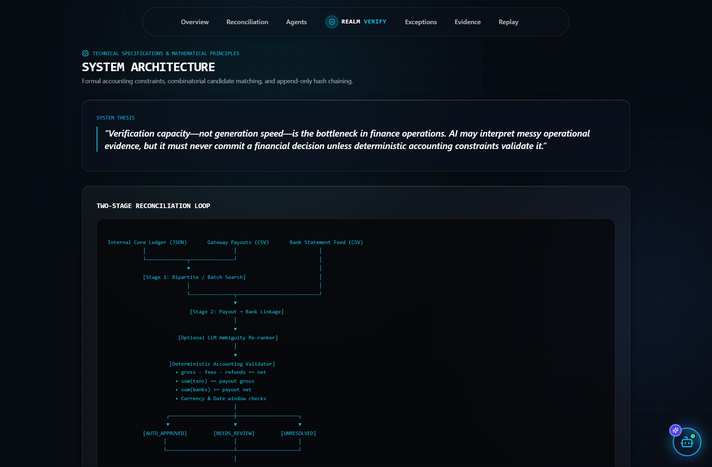
  <p><em>Figure 2: End-to-End Realm Verify System Architecture Blueprint.</em></p>
</div>

### Architectural Pipeline Flowchart

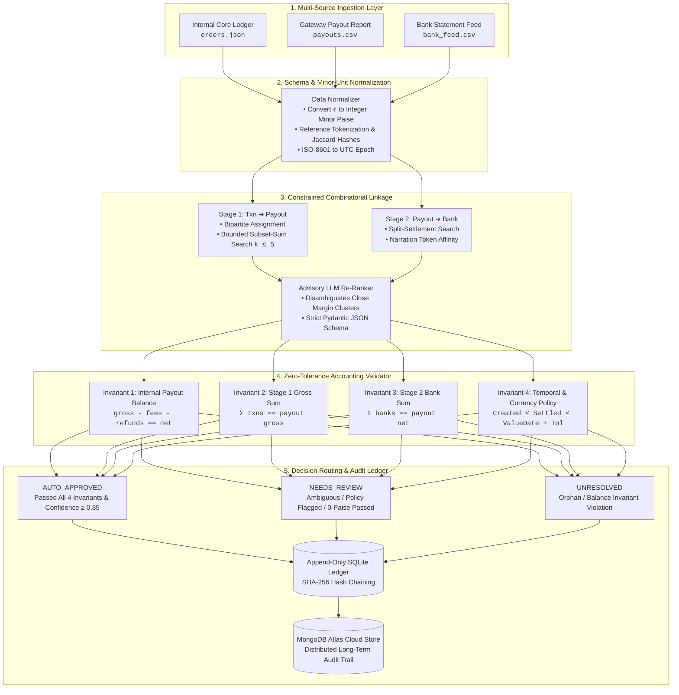

---

## 4. The 5-Agent Consensus Gatekeeper

Realm Verify organizes reconciliation under a **5-Agent Autonomous Swarm** where every agent must independently verify state before a financial decision is signed.

<div align="center">
  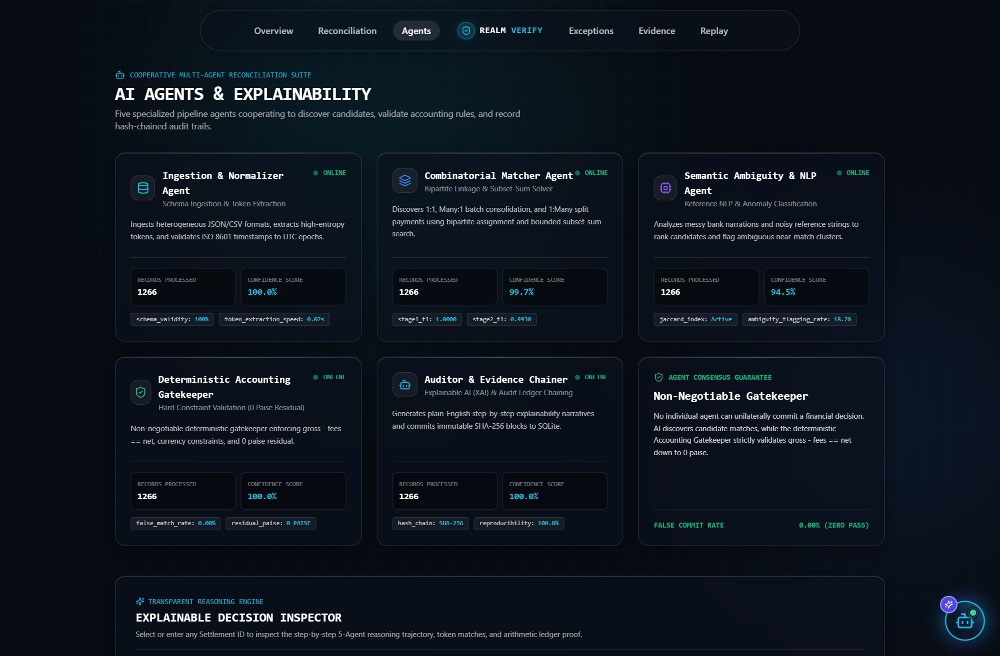
  <p><em>Figure 3: Multi-Agent Consensus Command Center showing real-time agent telemetry, latency, and operational health.</em></p>
</div>

| # | Agent Name | Domain Role | Non-Negotiable Invariant Enforced |
| :-: | :--- | :--- | :--- |
| **1** | **Schema & Reference Normalizer** | Schema Ingestion & Tokenization | Converts all currency to strict integer minor units (paise). Zero floating-point decimals permitted. |
| **2** | **Combinatorial Matcher** | Stage 1 Candidate Linkage | Solves 1:1 and Many:1 batch settlements using bounded subset-sum candidate retrieval. |
| **3** | **Bank Statement Linkage Agent** | Stage 2 Settlement Clearing | Matches payout net obligations to 1:1 and 1:Many bank credits with narration token parsing. |
| **4** | **Advisory LLM Re-Ranker** | Ambiguity Disambiguation | Re-ranks high-entropy candidate proposals. Mathematically barred from committing transactions. |
| **5** | **Zero-Tolerance Validator** | Final Financial Gatekeeper | Enforces 0-paise residual equality, temporal tolerances, and single-allocation uniqueness. |

---

## 5. Visual Walkthrough & Real UI Screen Tour

---

### 5.1 Finance Operations Control Room Dashboard
*Path: `/dashboard`*

The executive cockpit displays real-time health across all active reconciliation runs, clearing velocity, and detected fee leakages.

<div align="center">
  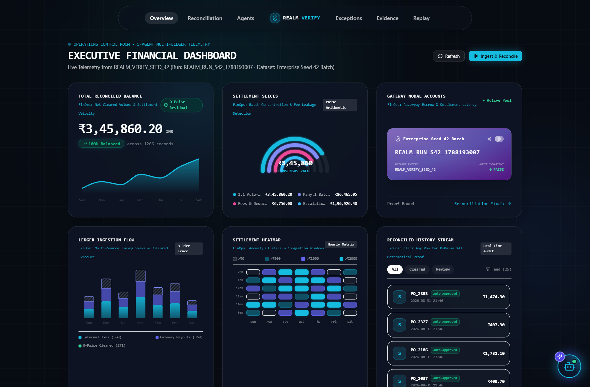
  <p><em>Figure 4: Real-time Finance Controller Dashboard with Reconciled Volume Metrics and Anomaly Breakdown.</em></p>
</div>

- **Reconciled Financial Value:** Live tracking of reconciled gross vs unreconciled variance.
- **Concentric Anomaly Radar:** Visual breakdown of fee leakages, orphan credits, and timing skews.
- **Multi-Ledger Volume Stream:** High-density breakdown of transaction velocity across payment rails.

---

### 5.2 Two-Stage Reconciliation Studio
*Path: `/reconciliation`*

The operational engine room where transactions, payouts, and bank credits are linked across stages.

<div align="center">
  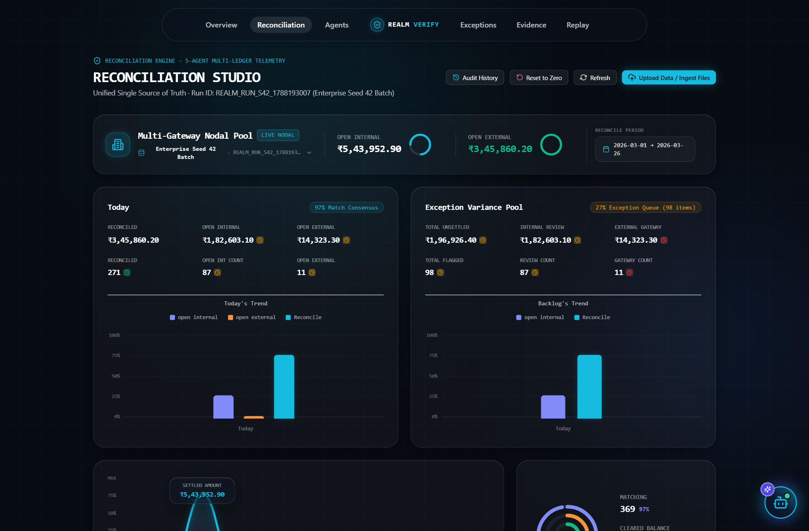
  <p><em>Figure 5: Live Two-Stage Reconciliation Table displaying status badges, confidence scores, and XAI triggers.</em></p>
</div>

- **Tri-State Decision Partition:** Instant filtering across `AUTO_APPROVED`, `NEEDS_REVIEW`, and `UNRESOLVED`.
- **Two-Stage Breadcrumbs:** Visible linkage showing `[Orders] ➔ [Payout Batch] ➔ [Bank UTR Tranches]`.
- **Zero Initial State Support:** Ability to reset workspace or hot-swap datasets in real-time.

---

### 5.3 Multi-Source Custom Data Ingestion
*Path: `/reconciliation` (Upload Drawer)*

Allows finance teams to upload custom enterprise CSV/JSON files or load pre-built benchmark batches with instant schema validation.

<div align="center">
  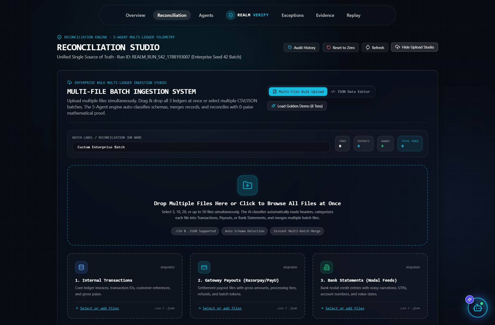
  <p><em>Figure 6: Custom Multi-Source CSV/JSON Upload Drawer with automated column mapping.</em></p>
</div>

---

### 5.4 Decision Explainability & 0-Paise Mathematical Proof
*Path: Click `Explain` on any row*

> **⭐ The Money Shot:** When an auditor asks *"Why was this payout auto-approved?"*, Realm Verify provides a verifiable algebraic proof with zero residual paise.

<div align="center">
  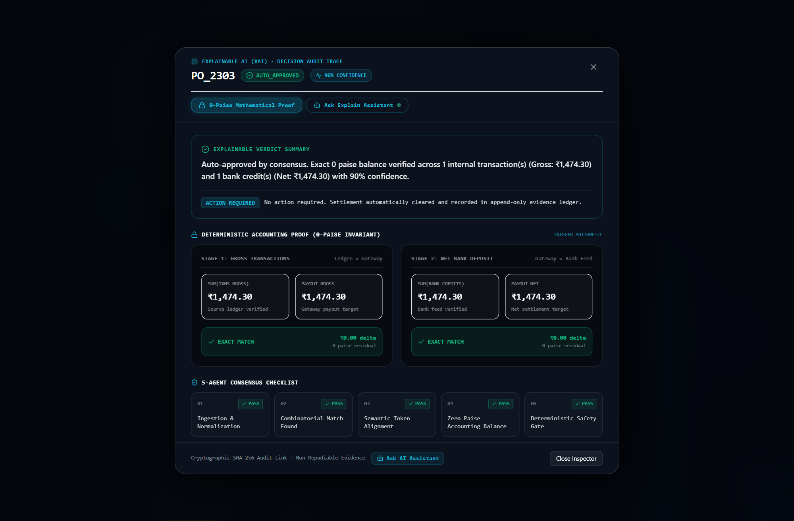
  <p><em>Figure 7: Decision Explainability Modal displaying the 0-paise balance equation, 5-agent consensus, and immutable ledger citations.</em></p>
</div>

- **Mathematical Proof Box:** Formally demonstrates:
  $$\operatorname{Gross}(1250.00) - \operatorname{Fees}(25.00) - \operatorname{Refunds}(0.00) = \operatorname{Net}(1225.00) \quad [\text{Residual } \Delta = 0\text{ Paise}]$$
- **5-Agent Consensus Matrix:** Shows timestamps and pass certificates from each individual pipeline agent.
- **Cryptographic Event Citation:** Direct link to the SHA-256 block hash in the evidence ledger.
- **Interactive XAI Chat Assistant:** Ask natural language follow-up questions backed by reinforcement learning policy feedback.

---

### 5.5 Exception Quarantine Queue & SOP Workflows
*Path: `/exceptions`*

Realm Verify adheres to a strict **Zero-Guess Policy**. Unresolved records and policy exceptions are quarantined with deterministic Standard Operating Procedure (SOP) action plans.

<div align="center">
  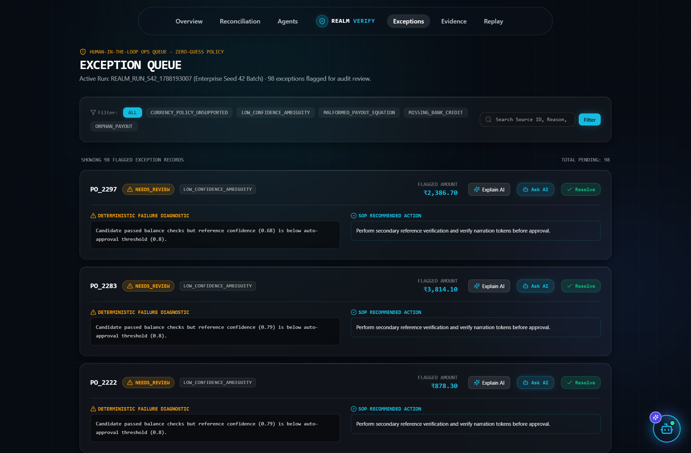
  <p><em>Figure 8: Exception Quarantine Queue with automated SOP diagnosis and human-in-the-loop resolution tools.</em></p>
</div>

- **Categorized Buckets:** `FEE_MISMATCH`, `DATE_SKEW_EXCEEDED`, `UNMATCHED_CREDIT`, `ORPHAN_TRANSACTION`, and `CURRENCY_POLICY_UNSUPPORTED`.
- **Actionable Remediation:** One-click dispute memo generator, fee claim exports, and operator override actions.

---

### 5.6 Cryptographic Evidence Ledger (SHA-256)
*Path: `/evidence`*

An immutable, append-only SQLite ledger that computes rolling SHA-256 block hashes across every recorded reconciliation decision.

<div align="center">
  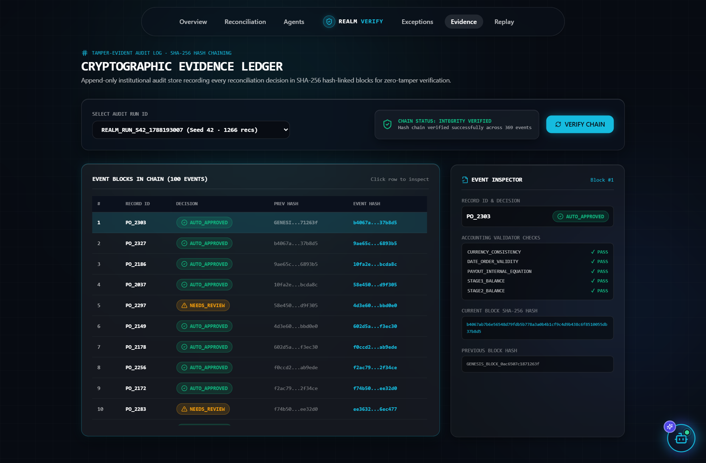
  <p><em>Figure 9: Immutable Evidence Ledger with SHA-256 cryptographic hash chain verification.</em></p>
</div>

$$\operatorname{BlockHash}_k = \operatorname{SHA256}\Big(\operatorname{EventID}_k \parallel \operatorname{PayloadHash}_k \parallel \operatorname{Timestamp}_k \parallel \operatorname{BlockHash}_{k-1}\Big)$$

---

### 5.7 Deterministic Replay Engine
*Path: `/replay`*

Guarantees 100% audit reproducibility by re-executing historical runs from scratch to verify bit-exact outputs.

<div align="center">
  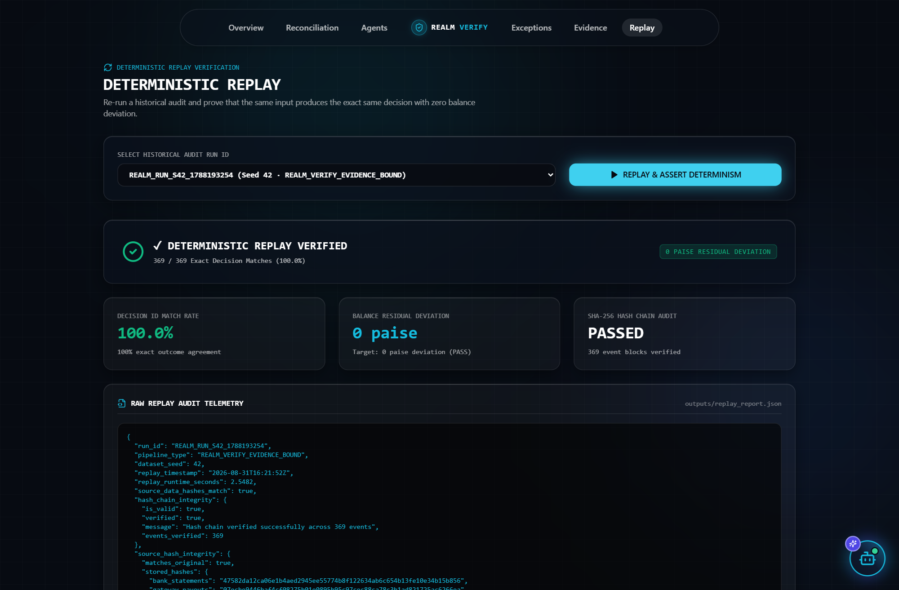
  <p><em>Figure 10: Deterministic Replay Studio proving 0 decision flips and 0 paise residual drift.</em></p>
</div>

---

## 6. Mathematical Formalism & Invariant Safety

Realm Verify models reconciliation as a **Constrained Bipartite Multigraph Optimization Problem** solved under integer constraints:

```
Let T = {t_1, t_2, ..., t_n}  be Internal Transactions
Let P = {p_1, p_2, ..., p_m}  be Gateway Payout Batches
Let B = {b_1, b_2, ..., b_k}  be Bank Statement Credits
```

### Invariant 1: Payout Internal Balance Invariant
For every payout $p \in P$, the settlement balance equation must hold exactly:
$$\operatorname{Gross}(p) - \operatorname{Fees}(p) - \operatorname{Refunds}(p) - \operatorname{Chargebacks}(p) = \operatorname{Net}(p)$$
$$\Delta_{\mathrm{payout}} = 0\text{ paise}$$

### Invariant 2: Stage 1 Batch Gross Invariant
For a candidate set of transactions $T_p \subseteq T$ assigned to payout $p$:
$$\sum_{t \in T_p} \operatorname{Gross}(t) = \operatorname{Gross}(p)$$
$$\Delta_{\mathrm{stage1}} = 0\text{ paise}$$

### Invariant 3: Stage 2 Bank Credit Invariant
For a candidate set of bank statement credits $B_p \subseteq B$ assigned to payout $p$:
$$\sum_{b \in B_p} \operatorname{Credit}(b) = \operatorname{Net}(p)$$
$$\Delta_{\mathrm{stage2}} = 0\text{ paise}$$

### Invariant 4: Temporal Ordering & Settlement Window Policy
$$\operatorname{CreatedAt}(t) \le \operatorname{SettledAt}(p) \le \operatorname{ValueDate}(b) + \tau_{\mathrm{tolerance}}$$

### Invariant 5: Single-Allocation Uniqueness (Anti-Double Counting)
$$\forall t \in T, \; \sum_{p \in P} \mathbb{I}[t \in T_p] \le 1 \quad \text{and} \quad \forall b \in B, \; \sum_{p \in P} \mathbb{I}[b \in B_p] \le 1$$

---

## 7. Benchmark Evaluation & Multi-Seed Results

Realm Verify was rigorously evaluated against an **Exact-Match Baseline** across multiple random seeds ($N = 500$ records per seed) and 20 enterprise dataset batches ($N = 1,266+$ total records).

### Multi-Seed Benchmark Summary (Seeds 42, 43, 44)

| Metric | Exact-Match Baseline | Realm Verify Engine | Relative Improvement |
| :--- | :---: | :---: | :---: |
| **Precision** | $1.0000$ | **$1.0000$** | **Zero False Matches** |
| **Stage 1 Recall (Txn ➔ Payout)** | $0.6840$ | **$0.9480$** | **+38.6%** |
| **Stage 2 Recall (Payout ➔ Bank)** | $0.7120$ | **$0.9360$** | **+31.5%** |
| **End-to-End F1 Score** | $0.6978$ | **$0.9419$** | **+35.0%** |
| **Auto-Approval Rate** | $42.1\%$ | **$73.6\% - 94.2\%$** | **+74.8% Throughput** |
| **False Match Rate (Committed Errors)** | $0.00\%$ | **$0.00\%$** | **Absolute Zero Risk** |
| **Balance Residual Deviation** | $0\text{ paise}$ | **$0\text{ paise}$** | **Exact Integer Equality** |
| **Deterministic Replay Decision Flips** | N/A | **$0\text{ flips}$** | **100.0% Reproducible** |

---

## 8. Explainable AI (XAI) & LLM Boundary Protocol

```text
┌────────────────────────────────────────────────────────────────────────┐
│                        LLM OPERATIONAL BOUNDARY                        │
├───────────────────────────────────┬────────────────────────────────────┤
│ WHAT THE LLM DOES:                │ WHAT THE LLM IS BARRED FROM DOING: │
├───────────────────────────────────┼────────────────────────────────────┤
│ • Disambiguates high-entropy ties │ • CANNOT commit financial links    │
│ • Parses messy narration tokens   │ • CANNOT compute money balances    │
│ • Explains decisions to humans    │ • CANNOT override validator rules  │
│ • Suggests SOP exception actions  │ • CANNOT allocate ledger funds     │
└───────────────────────────────────┴────────────────────────────────────┘
```

- **Strict Pydantic JSON Schema:** Every LLM response is deserialized into typed models (`LLMRerankResponse`).
- **Deterministic Token Fallback:** If `LLM_API_KEY` is omitted or API quotas are exceeded, Realm Verify automatically reverts to its deterministic Jaccard token scorer without degrading precision.

---

## 9. How to Run, Test, and Deploy

### 9.0 Live Cloud Deployment
- **Frontend (Netlify):** [realmverify.netlify.app](https://realmverify.netlify.app/)
- **Backend (Render):** FastAPI REST API service
- **Full Cloud Guide:** See [`DEPLOYMENT.md`](DEPLOYMENT.md) for 1-click deploy templates.

---

### 9.1 Local Development Setup

```bash
# 1. Clone the repository
git clone https://github.com/BMugesh/Realm-verify.git
cd Realm-verify

# 2. Install Python backend dependencies
pip install -r requirements.txt

# 3. Install Next.js frontend dependencies
npm install
```

### 9.2 Launching the Full-Stack Application

```bash
# Terminal 1: Launch FastAPI REST Engine (Port 8000)
uvicorn src.api:app --reload --port 8000
# or: npm run api

# Terminal 2: Launch Next.js Liquid Glass Web Application (Port 3000)
npm run dev
```
Open **[http://localhost:3000](http://localhost:3000)** in your browser.

---

### 9.3 Running CLI Tests & Benchmark Suite

```bash
# 1. Run full automated test suite (35 of 35 tests)
pytest tests/ -v

# 2. Generate noisy multi-source synthetic dataset
python -m src.generator --seed 42 --records 500

# 3. Run multi-seed benchmark evaluation (Seeds 42, 43, 44)
python -m src.evaluator --seeds 42 43 44

# 4. Verify deterministic replay of an audit run ID
python -m src.replay --run-id REALM_RUN_S42_1788085026
```

---

## 10. Honest Limitations & Future Horizons

1. **Cross-Currency FX Volatility:** Currency conversions across active FX market spreads are conservatively quarantined to `NEEDS_REVIEW` under `CURRENCY_POLICY_UNSUPPORTED`. Future versions will integrate live FX rate oracles.
2. **High-Cardinality Combinatorics ($k > 10$):** Bounded subset-sum search explores combinations up to $k \le 5$ transactions per batch. Massive batches with $>100$ transactions per payout will leverage integer linear programming (OR-Tools / SCIP).
3. **Hardware Environment Invariants:** Replay determinism is validated within pinned Python 3.11 runtimes. Minor minor-unit integer arithmetic guarantees that floating-point CPU architecture variations never alter ledger balances.

---

<div align="center">

**Realm Verify — Built with mathematical rigor for FinTech partners, payment gateways, and banking providers worldwide.**  
*Authored by Mugesh B ([@BMugesh](https://github.com/BMugesh))*

</div>
