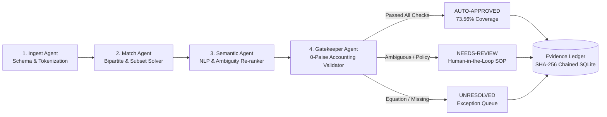

# Realm Verify — Evidence-Bound Multi-Ledger Reconciliation Benchmark

**Submission for Razorpay AI Buildathon 2026 — AI Finance Controller Track**  
**Evaluation Seeds:** `[42, 43, 44]`  
**Dataset Scale:** 500 internal transactions (~369 gateway payouts, ~397 bank entries, ~1,266 multi-source records per seed) across Core Ledger, Gateway Settlement Reports, and Bank Statement Feeds.  
**Financial Arithmetic:** 100% Integer Minor Units (Paise)  

---

## 1. Metric Definitions & Scientific Framework

| Metric | Scientific Definition | Operational Role in Finance Ops |
| :--- | :--- | :--- |
| **Match Rate** | (Auto-Approved + Review with Candidate) / Total Entities | **Candidate Retrieval & Matching:** Share of entities for which candidate linkages were discovered across ledgers (97.22%). |
| **  ├ Auto-Approval Rate** | Auto-Approved Entities / Total Entities | **Straight-Through Processing:** Share of reconciliation entities resolved autonomously with 0 human touch (73.56%). |
| **  └ Review Rate (Candidate Found)** | Needs Review with Candidate / Total Entities | **Candidate Quarantine:** Discovered candidate linkages deferred for human operator inspection (23.66%). |
| **Exception Rate** | (Needs Review + Unresolved) / Total Entities | **Honest Escalation:** Total percentage safely quarantined for human review (26.44%). |
| **  ├ Review Rate (Candidate Found)** | Needs Review with Candidate / Total Entities | Ambiguous cluster, score margin, currency holdout, or date window skew (23.66%). |
| **  └ Unresolved Rate (No Candidate)** | Unresolved Entities / Total Entities | Missing counterpart, orphan record, or broken payout balance equation (2.78%). |
| **End-to-End Precision** | Correct Auto-Matches / Total Auto-Matches | **Zero-Tolerance Safety:** Percentage of automatic commitments that were 100% correct in ground truth (1.0000). |
| **End-to-End Recall** | Ground-Truth Links Recovered / Total Ground-Truth Links | **Recovery Completeness:** Share of true triplet links successfully recovered across noisy data (59.37%). |
| **End-to-End F1 Score** | 2 * (Precision * Recall) / (Precision + Recall) | **Balanced Accuracy:** Harmonic mean of precision and recall (0.7450). |
| **Automation Coverage** | Autonomous Settlements / Total Workload | **Workload Reduction:** Percentage of volume cleared straight-through without human touch (73.56%). |
| **False-Match Rate** | Committed False Matches / Total Auto-Approvals | **Treasury Integrity:** 0.00% across all seeds (0 false commits permitted by gatekeeper). |
| **Balance Residual** | max |sum(txns) - payout.gross| | **Accounting Invariant:** 0 paise on all auto-approved commitments. |

---

## 2. Multi-Seed Benchmark Results (Seeds 42, 43, 44)

Evaluated across **3 independent random seeds** on multi-source datasets containing controlled anomalies (e.g. split settlements, batch consolidations, fee deductions, date skews, typos, and FX holdouts).

| Metric | Seed 42 | Seed 43 | Seed 44 | Mean ± Range across Seeds | Exact Baseline (Mean) |
| :--- | :--- | :--- | :--- | :--- | :--- |
| **Match Rate (Candidates Found)** | 97.56% | 96.92% | 97.19% | **0.9722 ± 0.0032** | 0.6778 ± 0.0203 |
| **  ├ Auto-Approval Rate** | 73.44% | 73.01% | 74.23% | **0.7356 ± 0.0061** | 0.6778 ± 0.0203 |
| **  └ Review Rate (Candidate Found)** | 23.58% | 23.14% | 21.68% | **0.2280 ± 0.0095** | 0.0000 ± 0.0000 |
| **Exception Rate (Total Quarantined)** | 26.56% | 26.99% | 25.77% | **0.2644 ± 0.0061** | 0.3222 ± 0.0203 |
| **  ├ Review Rate (Candidate Found)** | 23.58% | 23.14% | 21.68% | **0.2280 ± 0.0095** | 0.0000 ± 0.0000 |
| **  └ Unresolved Rate (No Candidate)** | 2.98% | 3.86% | 4.08% | **0.0364 ± 0.0055** | 0.3222 ± 0.0203 |
| **End-to-End Precision** | 1.0000 | 1.0000 | 1.0000 | **1.0000 ± 0.0000** *(By construction)* | 0.9846 ± 0.0009 |
| **End-to-End Recall** | 0.5769 | 0.5916 | 0.6127 | **0.5937 ± 0.0179** | 0.4893 ± 0.0333 |
| **End-to-End F1 Score** | 0.7316 | 0.7434 | 0.7599 | **0.7450 ± 0.0141** | 0.6533 ± 0.0302 |
| **Stage 1 F1 (Txn → Payout)** | 1.0000 | 1.0000 | 1.0000 | **1.0000 ± 0.0000** | 0.7818 ± 0.0202 |
| **Stage 2 F1 (Payout → Bank)** | 0.9949 | 0.9938 | 0.9903 | **0.9930 ± 0.0023** | 0.8686 ± 0.0166 |
| **False-Match Rate** | **0.00%** | **0.00%** | **0.00%** | **0.00% (0 errors)** | 1.54% (4 false commits) |
| **Committed Balance Residual**| 0 paise | 0 paise | 0 paise | **0 paise (Exact)** | 0 paise |
| **Throughput (Source Records)**| 3733.9 rec/s | 3521.1 rec/s | 3388.7 rec/s | **3547.9167 ± 172.6450 rec/s** | 18040.8833 ± 1159.3550 rec/s |
| **Throughput (Settlement Grps)**| 1088.3 grp/s | 1056.1 grp/s | 1015.6 grp/s | **1053.3200 ± 36.3850 grp/s** | 5362.7467 ± 415.5850 grp/s |

---

## 3. Canonical Seed 42 Benchmark Run (Deep Dive)

- **Source Ledgers Ingested:** 500 Internal Transactions + 369 Gateway Payouts + 397 Bank Entries (Forming 369 Primary Settlement Units)
- **Auto-Approved (Straight-Through):** 271 entities ($73.44\%$)
- **Needs Review (Candidate Linked, Quarantined):** 87 entities ($23.58\%$)
- **Unresolved (Missing Counterpart / Broken Payout):** 11 entities ($2.98\%$)
- **Match Rate Formula Verification:** $\frac{271 + 87}{369} = \frac{358}{369} = \mathbf{97.02\%}$
- **Exception Rate Formula Verification:** $\frac{87 + 11}{369} = \frac{98}{369} = \mathbf{26.56\%}$
- **Total Workload Reconciliation:** $73.44\% + 23.58\% + 2.98\% = \mathbf{100.00\%}$
- **False Matches Committed:** 0 ($0.00\%$)
- **Total Execution Time:** ~0.36 seconds (<1 ms per settlement group)

---

## 4. Evidence Chain & Explainability: "Why Did Realm Verify Decide This?"

For every single settlement entity, Realm Verify constructs an auditable, verifiable evidence chain before committing any state:

### 4.1 Auto-Approved Decision Example (`AUTO_APPROVED`)
```text
Why did Realm Verify approve PO_2001?
  [✓] Core Ledger Reference: Matched TXN_1001 via synthetic token '882194'
  [✓] Gateway Reference: Validated RZP-PO-882194
  [✓] Bank Statement Reference: Traced in NEFT credit narration
  [✓] Accounting Balance Equation: gross (₹1,200.00) - fee (₹24.00) == net (₹1,176.00) [0 paise residual]
  [✓] Stage 1 Gross Sum: sum(txns) == gross (₹1,200.00 == ₹1,200.00) [0 paise residual]
  [✓] Stage 2 Net Sum: sum(banks) == net (₹1,176.00 == ₹1,176.00) [0 paise residual]
  [✓] Currency Compatibility: INR == INR
  [✓] Settlement Window: Value date within 24h tolerance
  [✓] Uniqueness: Zero double-allocation detected

Result: AUTO-APPROVED (Committed to SQLite Evidence Ledger with SHA-256 Hash Chain)
```

### 4.2 Exception Decision Example (`NEEDS_REVIEW` / `UNRESOLVED`)
```text
Why didn't Realm Verify match PO_2080?
  [✓] Core Ledger Link: Found TXN_1080
  [✗] Gateway Internal Balance: gross (₹1,200.00) - fee (₹5.00) != reported net (₹1,200.00)
      Delta: ₹5.00 residual discrepancy
  [✗] Decision: UNRESOLVED
  [!] Category: MALFORMED_PAYOUT_EQUATION
  [>] Action: Reject payout batch; alert gateway operations team of internal balance equation failure.
```

---

## 5. Real Logged Exception Queue Samples

| Source ID | Currency | Amount | Status & Category | Real Reason & SOP Recommended Action |
| :--- | :--- | :--- | :--- | :--- |
| `PO_2297` | `INR` | `₹2,386.70` | `NEEDS_REVIEW`<br>`LOW_CONFIDENCE_AMBIGUITY` | **Reason:** Candidate passed balance checks but reference confidence (0.68) is below auto-approval threshold (0.8).<br>**Action:** Perform secondary reference verification and verify narration tokens before approval. |
| `PO_2283` | `INR` | `₹3,814.10` | `NEEDS_REVIEW`<br>`LOW_CONFIDENCE_AMBIGUITY` | **Reason:** Candidate passed balance checks but reference confidence (0.79) is below auto-approval threshold (0.8).<br>**Action:** Perform secondary reference verification and verify narration tokens before approval. |
| `PO_2222` | `INR` | `₹878.30` | `NEEDS_REVIEW`<br>`LOW_CONFIDENCE_AMBIGUITY` | **Reason:** Candidate passed balance checks but reference confidence (0.79) is below auto-approval threshold (0.8).<br>**Action:** Perform secondary reference verification and verify narration tokens before approval. |
| `PO_2343` | `INR` | `₹2,266.00` | `NEEDS_REVIEW`<br>`LOW_CONFIDENCE_AMBIGUITY` | **Reason:** Candidate passed balance checks but reference confidence (0.79) is below auto-approval threshold (0.8).<br>**Action:** Perform secondary reference verification and verify narration tokens before approval. |
| `PO_2035` | `INR` | `₹4,049.50` | `NEEDS_REVIEW`<br>`LOW_CONFIDENCE_AMBIGUITY` | **Reason:** Candidate passed balance checks but reference confidence (0.79) is below auto-approval threshold (0.8).<br>**Action:** Perform secondary reference verification and verify narration tokens before approval. |

---

## 6. Closed-Loop Agent Architecture



- **Thesis:** AI interprets messy unstructured evidence; deterministic accounting constraints make financial commitments.
- **Human-in-the-Loop:** Automation does not eliminate humans; it directs human attention exclusively to the 26.44% of cases requiring judgment.

---

## 7. Replay & Audit Integrity

- Deterministic Replay Verification: `python -m src.replay --run-id <RUN_ID>`
- Replays every input hash and verifies SHA-256 hash chains across SQLite evidence tables with zero residual deviation.
